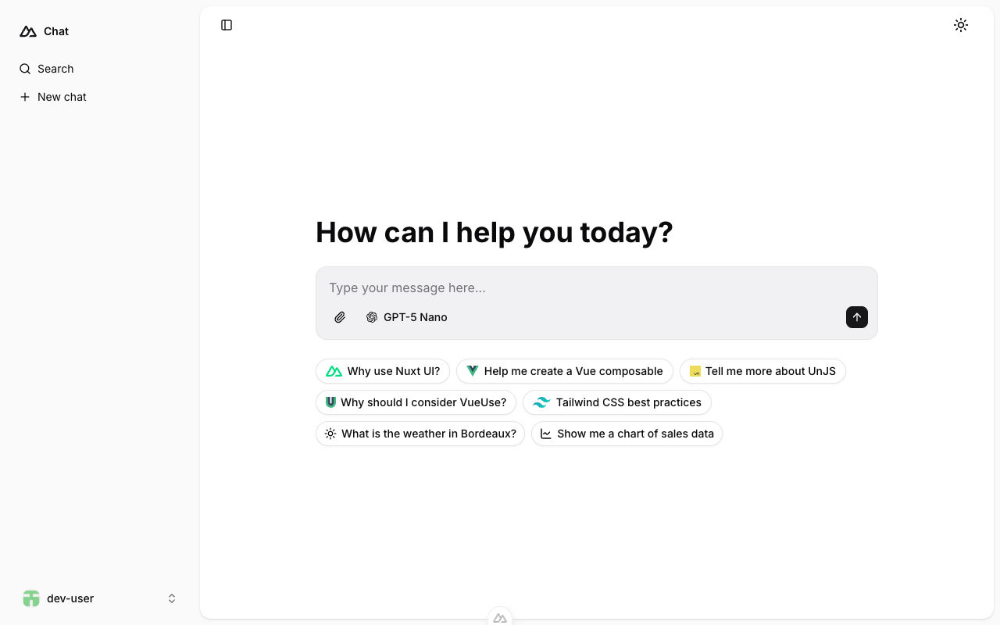

# Nuxt AI Chatbot Template

### shadcn-vue variant

[](https://www.shadcn-vue.com)

Full-featured AI Chatbot Nuxt application with authentication, chat history, multiple pages, collapsible sidebar, keyboard shortcuts, light & dark mode, command palette and more. Built using [shadcn-vue](https://www.shadcn-vue.com) (reka-ui) components and integrated with [AI SDK](https://ai-sdk.dev) for a complete chat experience.

- [Live demo](https://shadcn-nuxt-ui-chat.stackhacker.io)

<picture>
  <source media="(prefers-color-scheme: dark)" srcset="public/screenshots/chat-dark.png">
  <source media="(prefers-color-scheme: light)" srcset="public/screenshots/chat-light.png">
  
</picture>

## Features

- ⚡️ **Streaming AI messages** powered by the [AI SDK](https://ai-sdk.dev)
- 🤖 **Multiple model support** via various AI providers with built-in AI Gateway support
- 🎨 **shadcn-vue (reka-ui)** components with [Tailwind CSS v4](https://tailwindcss.com)
- 🔐 **Authentication** via [nuxt-auth-utils](https://github.com/atinux/nuxt-auth-utils)
- 💾 **Chat history persistence** using SQLite database (Turso in production) and [Drizzle ORM](https://orm.drizzle.team)
- 🔔 **Toast notifications** via [vue-sonner](https://vue-sonner.vercel.app)
- 🎯 **Icons** via [lucide-vue-next](https://lucide.dev)
- 🌗 **Dark mode** via [@nuxtjs/color-mode](https://color-mode.nuxtjs.org)
- 🚀 **Easy deploy** to Vercel with zero configuration

## Quick Start

```bash
git clone https://github.com/shadcn-nuxt-ui/chat.git
cd chat
pnpm install
pnpm db:migrate
pnpm dev
```

## Deploy your own

[](https://vercel.com/new/clone?repository-name=chat&repository-url=https%3A%2F%2Fgithub.com%2Fshadcn-nuxt-ui%2Fchat&env=NUXT_SESSION_PASSWORD,NUXT_OAUTH_GITHUB_CLIENT_ID,NUXT_OAUTH_GITHUB_CLIENT_SECRET&products=%5B%7B%22type%22%3A%22integration%22%2C%22protocol%22%3A%22storage%22%2C%22productSlug%22%3A%22database%22%2C%22integrationSlug%22%3A%22tursocloud%22%7D%5D&demo-title=Nuxt%20Chat%20Template%20(shadcn-vue)&demo-description=An%20AI%20chatbot%20template%20built%20with%20shadcn-vue%20components%20and%20Vercel%20AI%20SDK.)

## Setup

Make sure to install the dependencies:

```bash
pnpm install
```

Run database migrations:

```bash
pnpm db:migrate
```

### AI Integration

This template uses the [Vercel AI SDK](https://ai-sdk.dev/) for streaming AI responses with support for multiple providers through [Vercel AI Gateway](https://vercel.com/docs/ai-gateway).

Set your AI provider configuration in `.env`:

```bash
# AI Configuration via Vercel AI Gateway (unified API for all providers)
AI_GATEWAY_API_KEY=<your-vercel-ai-gateway-api-key>
```

> [!TIP]
> With Vercel AI Gateway, you don't need individual API keys for OpenAI, Anthropic, etc. The AI Gateway provides a unified API to access hundreds of models through a single endpoint with automatic load balancing, fallbacks, and spend monitoring.

### Authentication (Optional)

This template uses [nuxt-auth-utils](https://github.com/atinux/nuxt-auth-utils) for authentication with GitHub OAuth.

To enable authentication, [create a GitHub OAuth application](https://github.com/settings/applications/new) and set:

```bash
NUXT_OAUTH_GITHUB_CLIENT_ID=<your-github-oauth-app-client-id>
NUXT_OAUTH_GITHUB_CLIENT_SECRET=<your-github-oauth-app-client-secret>
NUXT_SESSION_PASSWORD=<your-password-minimum-32-characters>
```

### Blob Storage (Optional)

This template uses [NuxtHub Blob](https://hub.nuxt.com/docs/features/blob) for file uploads, which supports multiple storage providers:

- **Local filesystem** (default for development)
- **Vercel Blob** (auto-configured when deployed to Vercel)
- **Cloudflare R2** (auto-configured when deployed to Cloudflare)
- **Amazon S3** (with manual configuration)

For **[Vercel Blob](https://vercel.com/docs/storage/vercel-blob)**, assign a Blob Store to your project from the Vercel dashboard (Project → Storage), then set the token for local development:

```bash
BLOB_READ_WRITE_TOKEN=<your-vercel-blob-token>
```

For **S3-compatible storage**, set:

```bash
S3_ACCESS_KEY_ID=<your-access-key-id>
S3_SECRET_ACCESS_KEY=<your-secret-access-key>
S3_BUCKET=<your-bucket-name>
S3_REGION=<your-region>
```

> [!NOTE]
> Without configuration, files are stored locally in `.data/hub/blob` during development.

## Development Server

Start the development server on `http://localhost:3000`:

```bash
pnpm dev
```

## Production

Build the application for production:

```bash
pnpm build
```

Locally preview production build:

```bash
pnpm preview
```

Check out the [deployment documentation](https://nuxt.com/docs/getting-started/deployment) for more information.

## Based on

This project is a [shadcn-vue](https://www.shadcn-vue.com) variant of the official [Nuxt AI Chatbot Template](https://github.com/nuxt-ui-templates/chat) by the Nuxt UI team. The original template uses [Nuxt UI](https://ui.nuxt.com) components, while this version replaces them with shadcn-vue (reka-ui) + Tailwind CSS v4.

## Renovate integration

Install [Renovate GitHub app](https://github.com/apps/renovate/installations/select_target) on your repository and you are good to go.
