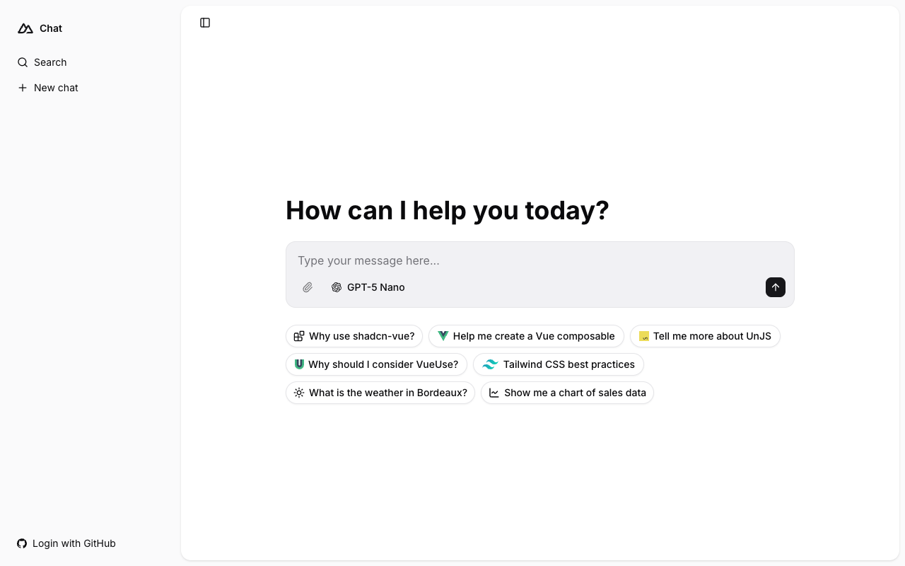

# Stackhacker UI Chat Template

[](https://www.shadcn-vue.com)

Full-featured AI chatbot Nuxt application with authentication, persistent chat history, file uploads, a collapsible sidebar, keyboard shortcuts, light and dark mode, command palette, tool rendering, and streaming AI responses. Built with [shadcn-vue](https://www.shadcn-vue.com) (reka-ui), Tailwind CSS v4, NuxtHub DB/Blob, and the [AI SDK](https://ai-sdk.dev).

- [Live demo](https://chat-template.stackhacker.io)
- [Source code](https://github.com/stackhacker-ui/chat)

<picture>
  <source media="(prefers-color-scheme: dark)" srcset="public/screenshots/chat-dark.png">
  <source media="(prefers-color-scheme: light)" srcset="public/screenshots/chat-light.png">
  
</picture>

## Features

- Streaming AI messages powered by the [AI SDK](https://ai-sdk.dev)
- Multiple model support through [Vercel AI Gateway](https://vercel.com/docs/ai-gateway)
- shadcn-vue (reka-ui) components with Tailwind CSS v4
- GitHub authentication via [nuxt-auth-utils](https://github.com/atinux/nuxt-auth-utils)
- Chat history persistence with SQLite/D1 through NuxtHub DB and Drizzle ORM
- File uploads through NuxtHub Blob with Cloudflare R2 in production
- Toast notifications via [vue-sonner](https://vue-sonner.vercel.app)
- Icons via [lucide-vue-next](https://lucide.dev)
- Dark mode via [@nuxtjs/color-mode](https://color-mode.nuxtjs.org)
- Cloudflare Workers deployment with Wrangler, D1, and R2 bindings

## Quick Start

Create a new app from this template:

```bash
pnpm dlx nuxi@latest init my-app -t gh:stackhacker-ui/chat
```

Install dependencies:

```bash
pnpm install
```

Copy the example environment file and fill in the values you need:

```bash
cp .env.example .env
```

Start the development server:

```bash
pnpm dev
```

Chat history and file upload flows require the database/blob configuration described below. If those services are not configured yet, the static app shell can load, but DB-backed API calls will fail until the Cloudflare/NuxtHub prerequisites are available.

Run database migrations after configuring the required Cloudflare credentials:

```bash
pnpm db:migrate
```

## Configuration

### AI Gateway

This template uses the [Vercel AI SDK](https://ai-sdk.dev/) with [Vercel AI Gateway](https://vercel.com/docs/ai-gateway) for streaming AI responses across multiple providers.

Set this value in `.env`:

```bash
AI_GATEWAY_API_KEY=<your-vercel-ai-gateway-api-key>
```

### Authentication

GitHub OAuth is powered by [nuxt-auth-utils](https://github.com/atinux/nuxt-auth-utils). To enable it, create a GitHub OAuth application and set:

```bash
NUXT_OAUTH_GITHUB_CLIENT_ID=<your-github-oauth-app-client-id>
NUXT_OAUTH_GITHUB_CLIENT_SECRET=<your-github-oauth-app-client-secret>
NUXT_SESSION_PASSWORD=<your-password-minimum-32-characters>
```

For local development, you can use the optional dev-auth environment variables documented in `.env.example` to skip GitHub OAuth. The included Cloudflare preview configuration also uses those variables to provide a shared preview user, so remove them from `wrangler.jsonc` if your preview deployment should require real OAuth.

### Storage

File uploads use [NuxtHub Blob](https://hub.nuxt.com/docs/features/blob).

- Local development stores files in `.data/hub/blob` by default.
- Production deployment uses the Cloudflare R2 binding configured in `nuxt.config.ts` and `wrangler.jsonc`.
- Custom deployments can wire NuxtHub Blob to another supported storage provider, but the included production configuration targets Cloudflare R2.

### Database

Chat history uses NuxtHub DB with Drizzle ORM.

- This template is configured for the Cloudflare D1 database in `nuxt.config.ts`.
- Local migration/deploy commands require NuxtHub Cloudflare credentials in `.env`.
- Wrangler applies remote D1 migrations during the Cloudflare deploy scripts.

Set these values before running `pnpm db:migrate` or deploying:

```bash
NUXT_HUB_CLOUDFLARE_ACCOUNT_ID=<your-cloudflare-account-id>
NUXT_HUB_CLOUDFLARE_DATABASE_ID=<your-cloudflare-d1-database-id>
NUXT_HUB_CLOUDFLARE_API_TOKEN=<your-cloudflare-api-token>
```

## Development

Common commands:

```bash
pnpm dev
pnpm lint
pnpm typecheck
pnpm build
pnpm db:generate
pnpm db:migrate
```

No automated test framework is configured in this template. Publication readiness currently relies on linting, type checking, production build, and browser verification.

## Deployment

The official demo deployment for this template uses Cloudflare Workers through Wrangler, with Cloudflare D1 and R2 bindings.

Production deployment:

```bash
pnpm deploy
```

Preview deployment:

```bash
pnpm deploy:preview
```

The GitHub Actions deployment workflows use the same Cloudflare path. Configure these repository secrets before enabling automated deploys:

```bash
CLOUDFLARE_API_TOKEN=<your-cloudflare-api-token>
CLOUDFLARE_ACCOUNT_ID=<your-cloudflare-account-id>
```

The canonical demo URL is:

```text
https://chat-template.stackhacker.io/
```

You may adapt the template for other deployment providers, but the included production scripts and workflows are Cloudflare-oriented.

## Publication Readiness Checklist

Before publishing or updating the live demo, verify:

- `pnpm lint` passes.
- `pnpm typecheck` passes.
- `pnpm build` passes.
- The live demo URL returns a successful response.
- Desktop and mobile browser checks cover the initial chat screen, existing chat screen, sidebar/search, model selector, color mode, file upload affordance, and delete confirmation.
- Browser console errors are reviewed.
- At least one representative AI/chat flow is checked, or missing credentials/service limits are recorded as deployment prerequisites.
- Preview auto-login behavior is acceptable for the deployment, or dev-auth variables are removed from the preview environment.
- Public docs and UI do not mention unpublished local files, secrets, or machine-specific paths.
- Screenshots reflect the current shadcn-vue implementation.

## Web Listing Inputs

Use these values when listing this template on Stackhacker UI:

| Field | Value |
| --- | --- |
| Name | Chat |
| Description | An open chat app starter for Nuxt with practical patterns you can adapt. |
| Features | GitHub authentication, persistent chat history, streaming AI responses |
| Demo | `https://chat-template.stackhacker.io` |
| Source | `https://github.com/stackhacker-ui/chat` |
| Preview images | `public/screenshots/chat-light.png`, `public/screenshots/chat-dark.png` |

## Based on

This project builds on the official [Nuxt AI Chatbot Template](https://github.com/nuxt-ui-templates/chat) by the Nuxt UI team. The original template uses [Nuxt UI](https://ui.nuxt.com) components, while the Stackhacker UI edition uses [shadcn-vue](https://www.shadcn-vue.com) (reka-ui) and Tailwind CSS v4.

## Renovate Integration

Install the [Renovate GitHub app](https://github.com/apps/renovate/installations/select_target) on your repository to keep dependencies current.
